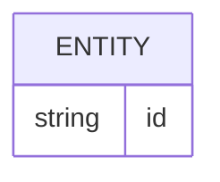

# Banco de dados

<!-- specsfy:documentator:start -->
## Fontes de persistência

| Arquivo |
| --- |
| .worktrees/feat/257-monorepo-foundation/apps/web/lib/database/user/migrations/index.ts |
| .worktrees/feat/257-monorepo-foundation/apps/web/lib/database/user/migrations/sql/0000_aromatic_polaris.sql |
| .worktrees/feat/257-monorepo-foundation/apps/web/lib/database/user/migrations/sql/0001_melodic_supreme_intelligence.sql |
| .worktrees/feat/257-monorepo-foundation/apps/web/lib/database/user/migrations/sql/meta/0000_snapshot.json |
| .worktrees/feat/257-monorepo-foundation/apps/web/lib/database/user/migrations/sql/meta/0001_snapshot.json |
| .worktrees/feat/257-monorepo-foundation/apps/web/lib/database/user/migrations/sql/meta/_journal.json |
| apps/web/lib/database/user/migrations/index.ts |
| apps/web/lib/database/user/migrations/sql/0000_aromatic_polaris.sql |
| apps/web/lib/database/user/migrations/sql/0001_melodic_supreme_intelligence.sql |
| apps/web/lib/database/user/migrations/sql/meta/0000_snapshot.json |
| apps/web/lib/database/user/migrations/sql/meta/0001_snapshot.json |
| apps/web/lib/database/user/migrations/sql/meta/_journal.json |
| Nenhuma estrutura confirmada além das fontes listadas. |

<!-- specsfy:documentator:end -->
